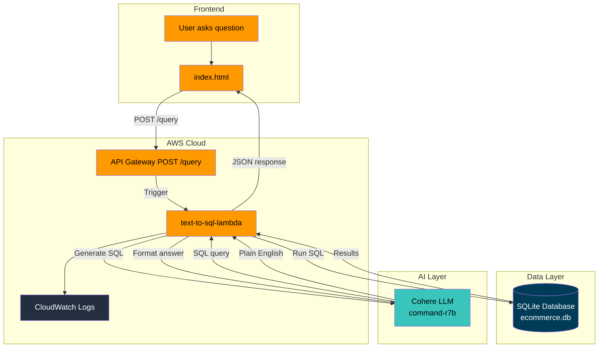
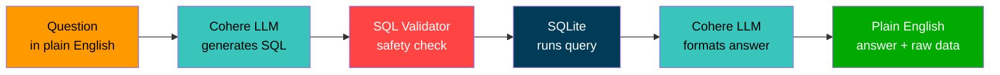
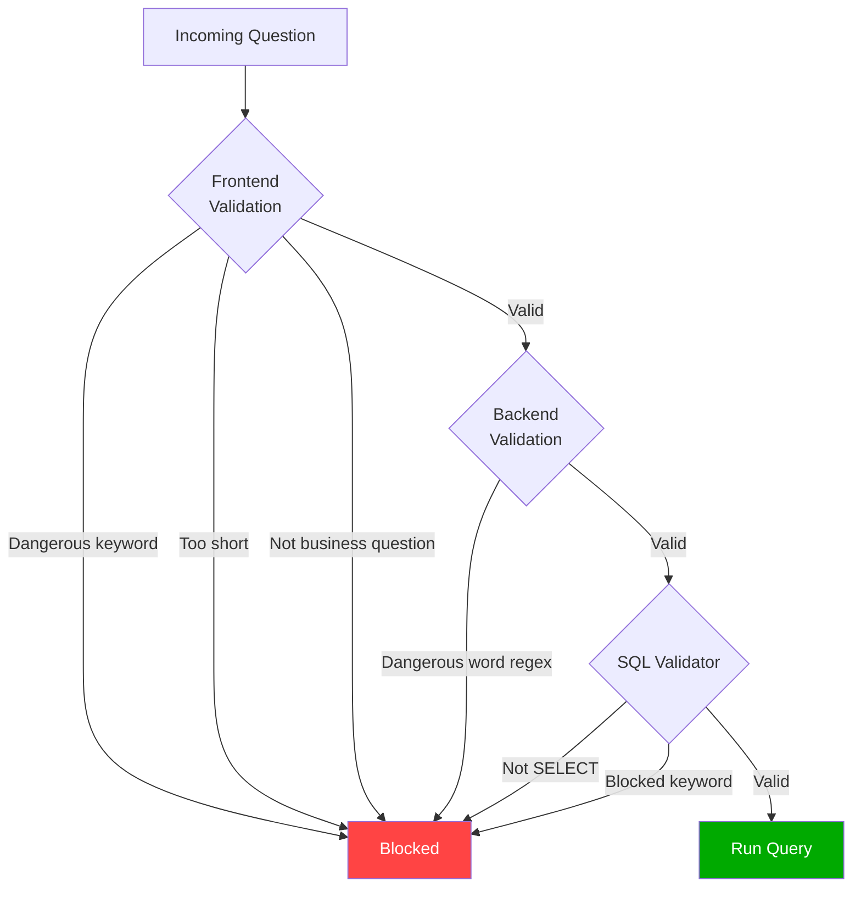
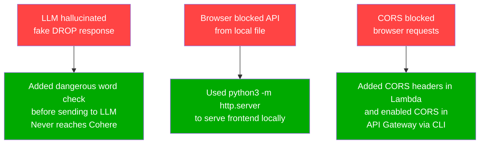

# Serverless Text-to-SQL Analytics Assistant

<div align="center">

**Ask business questions in plain English. Get SQL-backed answers instantly.**
No SQL knowledge needed. No servers to manage. Zero cost when idle.

[](https://aws.amazon.com)
[](https://python.org)
[](https://sqlite.org)
[](https://cohere.com)
[](https://aws.amazon.com/lambda)

</div>

---

## What Is This?

A serverless pipeline that lets anyone ask business questions in plain English
and get instant, accurate answers backed by real SQL queries and raw data.

No SQL knowledge needed. No servers to manage. No cost when idle.

---

### See It In Action

**You ask:**
```
What category has the most revenue?
```

**You get back:**

| | Output |
|---|---|
| **Answer** | Plain English summary |
| **Generated SQL** | Full transparent query |
| **Raw Data** | Actual database results |

---

**Answer**
```
- Books:       $268,016.58
- Home:        $200,764.71
- Sports:      $192,135.56
- Electronics: $166,006.86
- Clothing:    $153,973.68
```

**Generated SQL**
```sql
SELECT p.category,SUM(oi.quantity * oi.unit_price) AS total_revenue
FROM order_items oi
JOIN products p ON oi.product_id = p.product_id
GROUP BY p.category
ORDER BY total_revenue DESC
LIMIT 50;
```

**Raw Data**

| Category | Total Revenue |
|---|---|
| Books | $268,016.58 |
| Home | $200,764.71 |
| Sports | $192,135.56 |
| Electronics | $166,006.86 |
| Clothing | $153,973.68 |

---

> Every answer shows the generated SQL and raw data so results are always
> transparent and verifiable — no black box AI guessing.

## The Problem This Solves

Data analysts spend hours writing SQL for repetitive business questions.
Non-technical managers cannot query their own data without help.
BI teams are bottlenecked with simple requests.

This pipeline lets anyone ask business questions and get instant answers —
no SQL knowledge needed, no server running 24/7.

| Traditional Approach | This Pipeline |
|---|---|
| Write SQL manually | Ask in plain English |
| Need a data analyst | Anyone can use it |
| $50-100/month servers | $0.00 when idle |
| Keyword search only | AI-powered understanding |

---

## System Architecture



---

## How It Works



| Step | What Happens |
|:---:|---|
| 1 | User asks a business question via the frontend |
| 2 | API Gateway receives the request and triggers Lambda |
| 3 | Lambda validates the question — blocks dangerous inputs |
| 4 | Cohere LLM converts the question into a SQL query |
| 5 | SQL validator checks the query is safe |
| 6 | SQLite runs the query against the e-commerce database |
| 7 | Cohere formats the results into a plain English answer |
| 8 | Lambda returns JSON with question, SQL, results and answer |

---

## Database Schema

The project uses a fake e-commerce SQLite database with 4 tables:

```
customers(customer_id, customer_name, email, city, country, created_at)
  50 customers across London, New York, Toronto, Sydney, Berlin

products(product_id, product_name, category, price, stock_quantity)
  25 products across Electronics, Clothing, Books, Home, Sports

orders(order_id, customer_id, order_date, status, total_amount)
  200 orders with statuses: completed, pending, shipped, cancelled

order_items(item_id, order_id, product_id, quantity, unit_price)
  Line items linking orders to products
```

Example questions you can ask:
```
What are the top 5 products by revenue?
Which city has the most customers?
How many orders are pending?
What is total revenue in 2024?
Which product category generates the most revenue?
Top 3 customers by total orders
```

---

## Tech Stack

| Layer | Technology | Why |
|---|---|---|
| Frontend | HTML + CSS + JavaScript | Simple, no framework needed |
| Hosting | GitHub Pages | Free static hosting |
| API | AWS API Gateway HTTP API | Managed HTTPS, no server |
| Compute | AWS Lambda | Zero cost when idle |
| Database | SQLite | Packaged inside Lambda, no RDS cost |
| LLM | Cohere command-r7b | Fast, free tier, great at SQL |
| Monitoring | AWS CloudWatch | Real-time logs |
| Security | AWS IAM | Least privilege role |

---

## Security



| Layer | Protection |
|---|---|
| Frontend | Blocks dangerous keywords, enforces business questions, 200 char limit, 3s cooldown |
| Backend Lambda | Regex-based dangerous word detection including punctuation edge cases |
| SQL Validator | Only SELECT queries allowed, blocks INSERT/UPDATE/DELETE/DROP |
| API Gateway | Route-level throttling — 1 request/second, burst of 2 |
| IAM Role | Lambda has CloudWatch write access only |
| Secrets | Cohere API key stored as Lambda Environment Variable only |

---

## Project Structure

```
serverless-text-to-sql/

  index.html           - Frontend UI
  config.example.js    - API URL template (copy to config.js)
  setup_db.py          - Creates and seeds the SQLite database
  query.py             - Local test script
  schema.py            - Database schema sent to LLM
  sql_validator.py     - SQL safety checks
  lambda/
    handler.py         - Lambda function entry point
    ecommerce.db       - SQLite database (generated locally)
  .gitignore
  README.md
```

---

## Deploy It Yourself

### Prerequisites
- AWS account with CLI configured (`aws configure`)
- Free Cohere account at [cohere.com](https://cohere.com)
- Python 3.10+

---

<details>
<summary><b>Step 1 — Generate the SQLite Database</b></summary>

```bash
pip install python-dotenv
python setup_db.py
```

This creates `ecommerce.db` with 50 customers, 25 products, and 200 orders.

</details>

<details>
<summary><b>Step 2 — Test Locally</b></summary>

```bash
pip install cohere python-dotenv sqlparse

# Create .env file
echo "COHERE_API_KEY=your_key" > .env

# Run local test
python query.py
```

</details>

<details>
<summary><b>Step 3 — Package and Deploy Lambda</b></summary>

```bash
mkdir sql_deployment

pip install \
    --platform manylinux2014_x86_64 \
    --target=sql_deployment \
    --implementation cp \
    --python-version 3.12 \
    --only-binary=:all: \
    --no-compile \
    cohere

cp lambda/handler.py sql_deployment/
cp ecommerce.db sql_deployment/
cd sql_deployment && zip -r ../sql_deployment.zip . && cd ..

aws s3 cp sql_deployment.zip s3://your-bucket/sql_deployment.zip

aws lambda create-function \
  --function-name text-to-sql-lambda \
  --runtime python3.12 \
  --role arn:aws:iam::YOUR_ACCOUNT_ID:role/lambda-rag-role \
  --handler handler.handler \
  --timeout 60 \
  --memory-size 256 \
  --code S3Bucket=your-bucket,S3Key=sql_deployment.zip

aws lambda update-function-configuration \
  --function-name text-to-sql-lambda \
  --environment "Variables={COHERE_API_KEY=your_key}"
```

</details>

<details>
<summary><b>Step 4 — Create API Gateway</b></summary>

```
AWS Console → API Gateway → Create API → HTTP API
→ Integration: text-to-sql-lambda
→ Route: POST /query
→ Stage: $default (Auto-deploy ON)
```

Add throttling:
```bash
aws apigatewayv2 update-stage \
  --api-id YOUR_API_ID \
  --stage-name '$default' \
  --route-settings '{"POST /query":{"ThrottlingBurstLimit":2,"ThrottlingRateLimit":1}}' \
  --region us-east-1
```

</details>

<details>
<summary><b>Step 5 — Run the Frontend</b></summary>

```bash
cp config.example.js config.js
```

Edit `config.js` and add your API Gateway URL:
```javascript
const CONFIG = {
    API_URL: "https://YOUR_API_ID.execute-api.us-east-1.amazonaws.com/query"
};
```

Then open:
```bash
python3 -m http.server 8000
```

Go to `http://localhost:8000`

</details>

<details>
<summary><b>Step 6 — Test It</b></summary>

```bash
curl -s -X POST https://YOUR_API.execute-api.us-east-1.amazonaws.com/query \
  -H "Content-Type: application/json" \
  -d '{"question": "What are the top 5 products by revenue?"}' \
  | python3 -m json.tool
```

Expected:
```json
{
  "question": "What are the top 5 products by revenue?",
  "sql": "SELECT p.product_name, SUM(...) AS revenue FROM ...",
  "row_count": 5,
  "results": [...],
  "answer": "1. AWS Handbook — $70,006\n2. Lamp — $61,401..."
}
```

</details>

---

## Problems I Hit and How I Fixed Them



| Problem | Root Cause | Solution |
|---|---|---|
| LLM hallucinated DROP response | Question reached Cohere before validation | Block dangerous words before sending to LLM |
| Browser blocked API from `file://` | CORS blocks local file requests | Serve frontend via `python3 -m http.server` |
| CORS blocked browser requests | API Gateway not configured for CORS | Added CORS headers in Lambda and enabled CORS in API Gateway via CLI |

## What I Would Add Next

- [ ] Host frontend on GitHub Pages
- [ ] Add a Lambda authorizer for API access control
- [ ] Support natural language questions about multiple databases
- [ ] Add query history so users can see past questions
- [ ] Support CSV export of results
- [ ] Add more datasets beyond e-commerce

---
